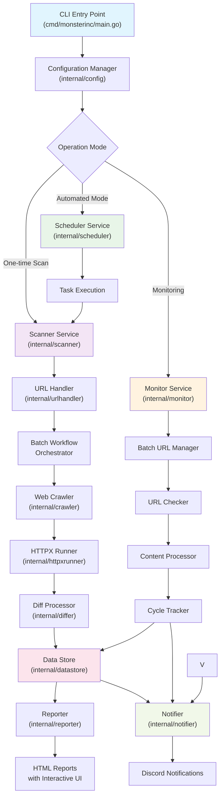

# MonsterInc

MonsterInc is a comprehensive security tool written in Go, specialized for URL collection from websites, HTTP/HTTPS probing, real-time content change monitoring, and detailed report generation. This tool is designed to support security professionals in web application reconnaissance and monitoring.

## Key Features

### 🕷️ URL Collection (Web Crawling)
- URL collection from websites with detailed scope configuration
- Headless browser support for dynamic content
- Scope control by hostname, subdomain, file extensions
- Resource extraction from HTML (images, scripts, stylesheets)
- **Responsive interrupt handling** - immediate stop upon receiving SIGINT/SIGTERM

### 🔍 HTTP/HTTPS Probing
- URL probing with integrated httpx engine
- Complete metadata extraction: headers, technologies, TLS information, ASN
- Smart retry and rate limiting support
- Automatic technology detection (tech detection)
- **Batch processing** - efficient processing for large datasets

### 📊 Real-time Change Monitoring
- Continuous website content monitoring with customizable intervals
- Change comparison using hash and diff algorithms
- **Batch URL processing** - efficient management of large URL sets
- Change history storage with Parquet format
- Visual HTML diff reports with change highlighting


### 📈 Reporting and Notifications
- Interactive HTML reports with DataTables
- Diff reports with syntax highlighting
- Automatic Discord notifications with file attachments
- Flexible template system for custom reports

## Installation

### Prerequisites
- Go 1.21+
- Google Chrome (for headless browsing)

### Build from source

```bash
git clone https://github.com/aleister1102/monsterinc.git
cd monsterinc
go build -o bin/monsterinc cmd/monsterinc/main.go
```

### From GitHub

```bash
go install github.com/aleister1102/monsterinc/cmd/monsterinc@latest
```

## Usage

### One-time Scan

```bash
./bin/monsterinc -config config.yaml -targets targets.txt
```

### Automated Scanning

```bash
./bin/monsterinc -config config.yaml -targets targets.txt -mode automated
```

### Monitoring Mode

```bash
./bin/monsterinc -config config.yaml -targets monitor-targets.txt -mode monitor
```

### Advanced Options

```bash
# Custom config location
./bin/monsterinc -config /path/to/config.yaml -targets targets.txt

# Override mode
./bin/monsterinc -config config.yaml -targets targets.txt -mode onetime

# Enable debug logging
./bin/monsterinc -config config.yaml -targets targets.txt -debug
```

## Configuration

Create `config.yaml` file:

```yaml
mode: "onetime"  # or "automated", "monitor"

crawler_config:
  max_depth: 3
  max_concurrent_requests: 20
  request_timeout_secs: 30
  seed_urls:
    - "https://example.com"
  
httpx_runner_config:
  threads: 50
  timeout_secs: 30
  tech_detect: true
  
monitor_config:
  enabled: true
  check_interval_seconds: 300
  max_concurrent_checks: 10
  
notification_config:
  scan_service_discord_webhook_url: "https://discord.com/api/webhooks/..."
  monitor_service_discord_webhook_url: "https://discord.com/api/webhooks/..."
  
storage_config:
  parquet_base_path: "./data"
  compression_codec: "zstd"
```

## System Architecture



## Development

### Project Structure
```
monsterinc/
├── cmd/monsterinc/          # CLI entry point
├── internal/                # Private packages
│   ├── scanner/            # Main orchestration
│   ├── monitor/            # Real-time monitoring  
│   ├── crawler/            # Web crawling
│   ├── httpxrunner/        # HTTP probing
│   ├── datastore/          # Data persistence
│   ├── differ/             # Content comparison
│   ├── reporter/           # Report generation
│   ├── notifier/           # Notifications
│   └── common/             # Shared utilities
├── configs/                 # Sample configurations
└── tasks/                  # Task definitions
```

### Testing

```bash
# Run all tests
go test ./...

# Run tests with coverage
go test -cover ./...

# Run specific package tests
go test ./internal/scanner/
```
