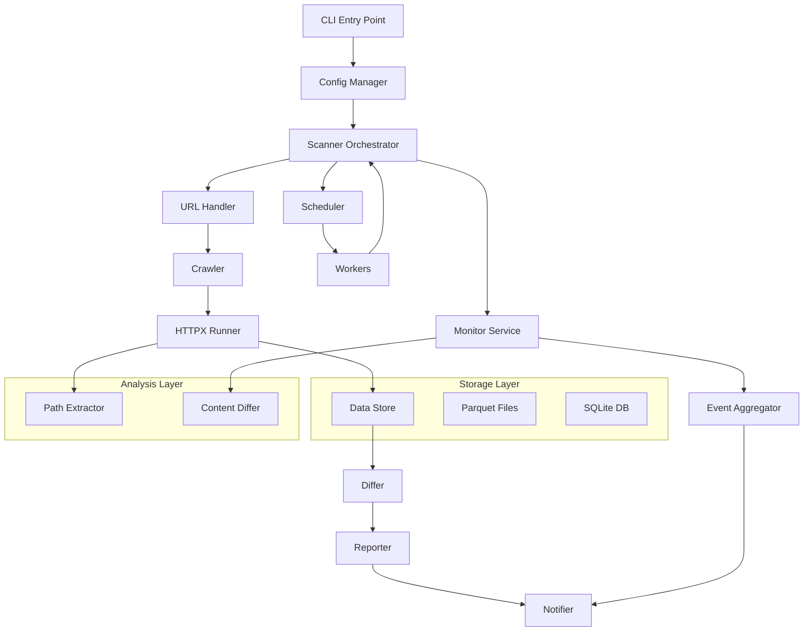
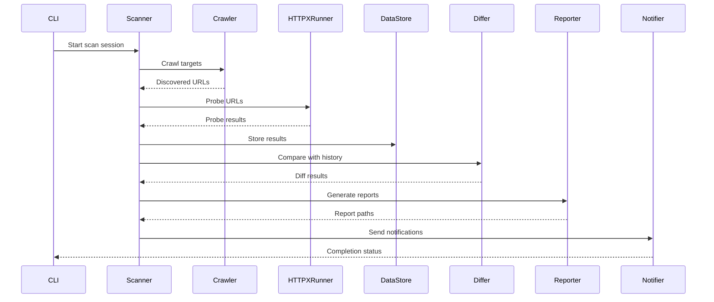
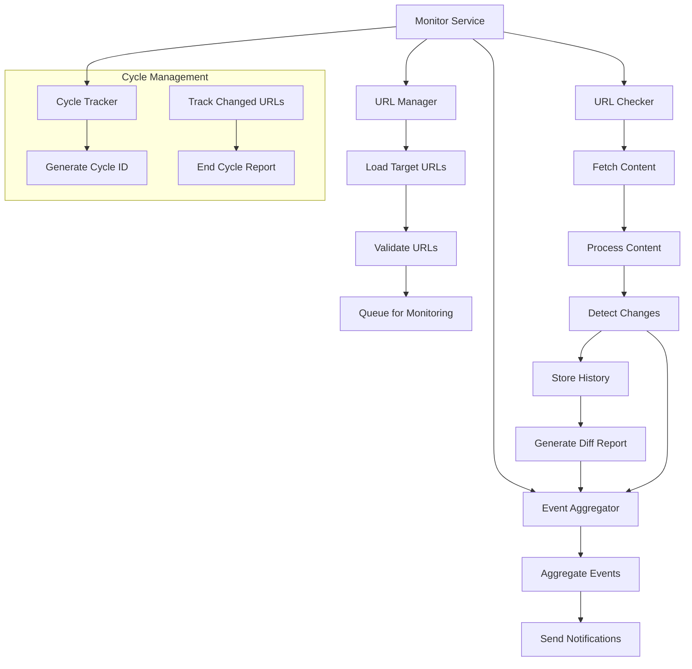
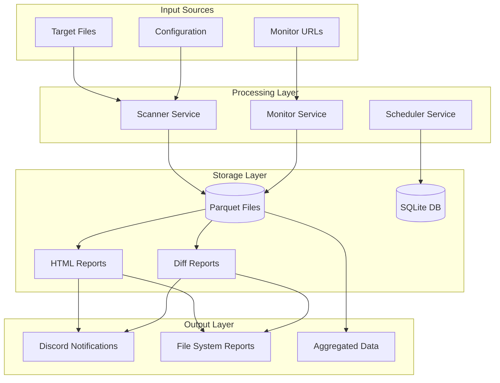
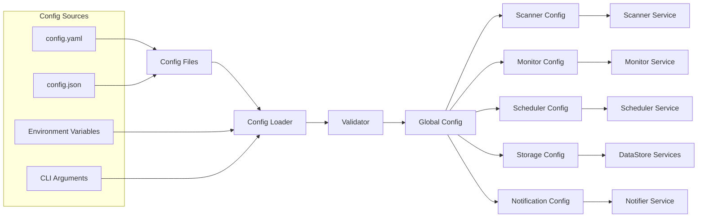

# MonsterInc

MonsterInc is a comprehensive security tool written in Go, specialized for website crawling, HTTP/HTTPS probing, real-time content change monitoring and detailed report generation. This tool is designed to support security professionals in reconnaissance and monitoring of web applications.

## Architecture Overview

MonsterInc is designed with a modular architecture featuring independent packages, each responsible for a specific part of the workflow:

### Core Data Flow



## Key Features

### 🕷️ Web Crawling
- URL collection from websites with detailed scope configuration
- Headless browser support for dynamic content
- Scope control by hostname, subdomain, file extension
- Asset extraction from HTML (images, scripts, stylesheets)
- **Responsive interrupt handling** - immediate stop on SIGINT/SIGTERM

### 🔍 HTTP/HTTPS Probing
- URL probing with integrated httpx engine
- Complete metadata extraction: headers, technologies, TLS info, ASN
- Support for custom headers, proxy, rate limiting
- Technology detection and fingerprinting
- **Context-aware cancellation** - graceful termination with active operation monitoring

### 📊 Intelligent Reporting
- Interactive HTML reports with search, filter, sort
- Content diff reports with side-by-side comparison
- Multi-part reports for large datasets
- Dark/light theme support

### 💾 Optimized Data Storage
- Parquet format with compression for high performance
- Structured data with schema versioning
- Time-series data with efficient querying
- Automatic file rotation and cleanup

### 🔄 Continuous Monitoring
- Real-time file monitoring with change detection
- Event aggregation and batch notifications
- Cycle-based monitoring with detailed reporting
- Content diff analysis for detected changes
- **Immediate interrupt response** - stops monitoring cycles instantly

### ⚙️ Advanced Configuration
- YAML/JSON configuration with validation
- Environment-based config resolution
- Hot-reload capabilities
- Hierarchical configuration merging

### 🔐 Security Analysis
- Path extraction from JS/HTML content
- API endpoint discovery

### 📈 Historical Analysis
- URL diff analysis (New/Old/Existing)
- Content change tracking
- Trend analysis and reporting
- Data retention policies

### 🚨 Interrupt Handling
- **Immediate response** to SIGINT/SIGTERM signals
- Context-based cancellation propagation across all components
- Graceful shutdown with 2-second timeout for active operations
- **Force quit** support (second interrupt signal)
- Comprehensive logging of shutdown process
- Safe resource cleanup and state preservation

### 🧠 Memory Management & Auto-Shutdown
- **System memory monitoring** using `gopsutil` for total system memory tracking
- **Configurable memory thresholds** - application memory (default: 1GB) and system memory (default: 50%)
- **Auto-shutdown capability** - graceful application termination when system memory exceeds threshold
- **Application memory limits** with automatic garbage collection triggers
- **Goroutine monitoring** with configurable warning thresholds
- **Resource usage logging** with detailed system and application memory statistics
- **Graceful shutdown callbacks** for custom cleanup logic during memory-triggered shutdowns

## Package Documentation

### Core Packages

- **[Scanner](internal/scanner/README.md)** - Main orchestration service, workflow coordination
- **[Monitor](internal/monitor/README.md)** - Continuous monitoring and change detection
- **[Scheduler](internal/scheduler/README.md)** - Automated task scheduling with SQLite persistence

### Data Processing

- **[Crawler](internal/crawler/README.md)** - Web crawling with asset extraction
- **[HTTPXRunner](internal/httpxrunner/README.md)** - HTTP probing and metadata extraction
- **[Differ](internal/differ/README.md)** - Content comparison and URL diff analysis
- **[Extractor](internal/extractor/README.md)** - Path extraction from JS/HTML content

### Data Management

- **[DataStore](internal/datastore/README.md)** - Parquet-based data storage and querying
- **[Models](internal/models/README.md)** - Data structures and schemas
- **[URLHandler](internal/urlhandler/README.md)** - URL processing and normalization

### Infrastructure

- **[Config](internal/config/README.md)** - Configuration management and validation
- **[Logger](internal/logger/README.md)** - Structured logging framework
- **[Common](internal/common/README.md)** - Shared utilities and patterns

### Output & Notification

- **[Reporter](internal/reporter/README.md)** - HTML report generation
- **[Notifier](internal/notifier/README.md)** - Discord notifications with file attachments

## Data Flow Diagrams

### Scanner Workflow



### Monitor Service Flow



### Data Storage Architecture



### Configuration Flow



## Quick Start

### Installation

```bash
# Clone repository
git clone https://github.com/aleister1102/monsterinc.git
cd monsterinc

# Build application
go mod tidy
go build -o monsterinc cmd/monsterinc/*.go
```

### Basic Usage

```bash
# One-time scan
./monsterinc -scan-targets targets.txt -config config.yaml -mode onetime

# Automated monitoring 
./monsterinc -scan-targets targets.txt -monitor-targets monitor.txt -config config.yaml -mode automated
```

### Interrupt Handling

MonsterInc provides immediate response to interrupt signals:

```bash
# During any operation, press Ctrl+C to interrupt
./monsterinc -scan-targets large-targets.txt -config config.yaml -mode onetime
# Press Ctrl+C - operation stops within 2 seconds

# Force quit with double interrupt
# Press Ctrl+C twice for immediate termination
```

**Signal Behavior:**
- **First SIGINT/SIGTERM**: Graceful shutdown with 2-second timeout
- **Second SIGINT/SIGTERM**: Force quit immediately
- **Context cancellation**: Propagates to all active components
- **Resource cleanup**: Automatic cleanup of temporary files and connections
- **Partial results**: Available for interrupted scans

## Configuration

### Configuration File Priority

1. `--globalconfig` parameter
2. `MONSTERINC_CONFIG` environment variable
3. `config.yaml` in working directory
4. `config.json` in working directory

### Configuration Structure

```yaml
# Core service configurations
scanner_config: {...}      # Main scanning workflow
monitor_config: {...}      # Continuous monitoring
scheduler_config: {...}    # Automated scheduling

# Data processing
crawler_config: {...}      # Web crawling settings
httpx_runner_config: {...} # HTTP probing settings
differ_config: {...}       # Content comparison
extractor_config: {...}    # Path extraction

# Storage & output
storage_config: {...}      # Parquet storage
reporter_config: {...}     # HTML reports
notification_config: {...} # Discord notifications

# Infrastructure
log_config: {...}          # Logging configuration
```

See [config.example.yaml](configs/config.example.yaml) for a complete configuration template.

## Project Structure

```
monsterinc/
├── cmd/monsterinc/           # Application entry point
├── internal/                 # Core application logic
│   ├── scanner/             # Main orchestration service
│   ├── monitor/             # Continuous monitoring
│   ├── scheduler/           # Automated scheduling
│   ├── crawler/             # Web crawling
│   ├── httpxrunner/         # HTTP probing
│   ├── differ/              # Content comparison
│   ├── extractor/           # Path extraction
│   ├── datastore/           # Data storage (Parquet)
│   ├── reporter/            # HTML report generation
│   ├── notifier/            # Discord notifications
│   ├── config/              # Configuration management
│   ├── logger/              # Logging framework
│   ├── models/              # Data structures
│   ├── common/              # Shared utilities
│   └── urlhandler/          # URL processing
├── configs/                  # Configuration files
├── database/                # Parquet storage
├── reports/                 # Generated reports
├── tasks/                   # Development tasks & PRDs
└── target/                  # Target URL files
```

## Development

### Package Dependencies

Each package is designed with clear dependencies to maintain modularity:

- **Scanner** depends on all processing packages
- **Monitor** is independent from scanner, shares components via common
- **Scheduler** orchestrates both Scanner and Monitor
- **Common** package has no dependencies on business logic packages
- **Models** defines shared data structures

### Testing

```bash
# Run all tests
go test ./...

# Test specific package
go test ./internal/scanner/...

# Run with coverage
go test -cover ./...
```

### Contributing

1. Fork repository
2. Create feature branch
3. Implement changes with appropriate tests
4. Update documentation
5. Submit pull request

## Performance Considerations

### Memory Management
- Buffer pooling for large data processing
- Streaming reads for Parquet files
- Resource limiting to prevent OOM

### Concurrency
- Worker pools for HTTP requests
- Channel-based coordination
- Context-based cancellation

### Storage Optimization
- Parquet compression (ZSTD default)
- Efficient schema design
- Automatic file rotation

## Monitoring & Observability

### Logging
- Structured logging with zerolog
- Multiple output formats (JSON, console)
- Log rotation and retention

### Metrics
- Processing statistics
- Performance metrics
- Error tracking

### Health Checks
- Service health monitoring
- Resource usage tracking
- Automatic cleanup procedures

## License

Distributed under the MIT License. See `LICENSE` for more information.

## Credits

- [httpx](https://github.com/projectdiscovery/httpx) by ProjectDiscovery
- [jsluice](https://github.com/BishopFox/jsluice) by BishopFox
- [parquet-go](https://github.com/parquet-go/parquet-go) for data storage
- [colly](https://github.com/gocolly/colly) for web crawling
