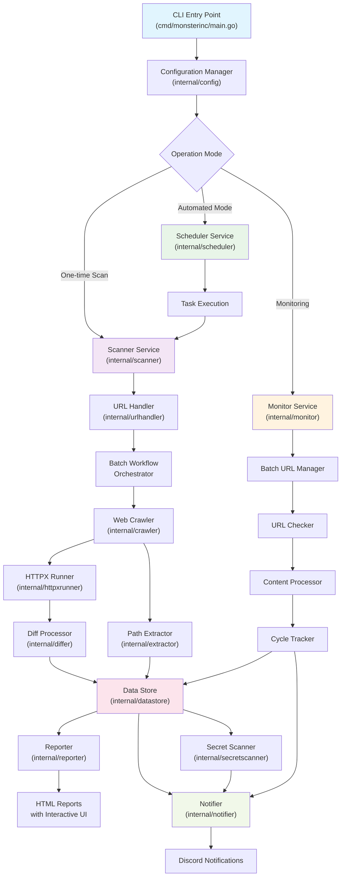

# MonsterInc

MonsterInc là một công cụ bảo mật toàn diện được viết bằng Go, chuyên dụng cho việc thu thập URL từ website, thăm dò HTTP/HTTPS, giám sát thay đổi nội dung theo thời gian thực và tạo báo cáo chi tiết. Công cụ này được thiết kế để hỗ trợ các chuyên gia bảo mật trong việc trinh sát và giám sát ứng dụng web.

## Tính năng chính

### 🕷️ Thu thập URL (Web Crawling)
- Thu thập URL từ website với cấu hình phạm vi chi tiết
- Hỗ trợ trình duyệt headless cho nội dung động  
- Kiểm soát phạm vi theo hostname, subdomain, phần mở rộng file
- Trích xuất tài nguyên từ HTML (hình ảnh, script, stylesheet)
- **Xử lý tín hiệu ngắt responsive** - dừng ngay lập tức khi nhận SIGINT/SIGTERM

### 🔍 Thăm dó HTTP/HTTPS
- Thăm dò URL với engine httpx tích hợp
- Trích xuất metadata hoàn chỉnh: headers, công nghệ, thông tin TLS, ASN
- Hỗ trợ retry và rate limiting thông minh
- Phát hiện công nghệ tự động (tech detection)
- **Batch processing** - xử lý hiệu quả cho tập dữ liệu lớn

### 📊 Giám sát thay đổi thời gian thực
- Theo dõi nội dung website liên tục với interval tùy chỉnh
- So sánh thay đổi bằng hash và diff algorithms
- **Batch URL processing** - quản lý hiệu quả URL sets lớn
- Lưu trữ lịch sử thay đổi với Parquet format
- Tạo báo cáo diff HTML trực quan với highlight thay đổi

### 🔒 Phát hiện Secret/API Keys
- Quét và phát hiện các secret, API keys, tokens trong mã nguồn
- Regex patterns được tối ưu cho các dịch vụ phổ biến
- Tích hợp với workflow crawling và monitoring
- Báo cáo chi tiết với context và vị trí

### 📈 Báo cáo và Thông báo
- Tạo báo cáo HTML interactive với DataTables
- Diff reports với syntax highlighting
- Thông báo Discord tự động với file đính kèm
- Template system linh hoạt cho custom reports

## Kiến trúc hệ thống



## Cấu trúc thư mục

### Core Components

#### `cmd/monsterinc/`
- **`main.go`** - Entry point chính với flag parsing và signal handling
- **`flags.go`** - Command-line flags và validation

#### `internal/scanner/`
- **Main orchestrator** cho toàn bộ scanning pipeline
- Quản lý workflow từ crawling → probing → diffing → reporting
- Hỗ trợ batch processing cho dataset lớn
- Integration với tất cả components khác

#### `internal/monitor/`
- **Real-time monitoring service** cho web content changes
- Batch URL management cho efficient processing
- Change detection với content hashing
- Cycle tracking và progress management

#### `internal/crawler/`
- **Web crawling engine** dựa trên Colly framework
- Asset extraction từ HTML/CSS/JS
- Headless browser support cho dynamic content
- Scope management và URL filtering

#### `internal/httpxrunner/`
- **HTTP probing wrapper** cho httpx library
- Result mapping và error handling
- Technology detection và metadata extraction

#### `internal/datastore/`
- **Parquet-based storage layer** cho high-performance persistence
- Streaming operations cho memory efficiency
- File history tracking cho monitoring
- Schema optimization cho scan results

#### `internal/differ/`
- **Content comparison engine** với diff algorithms
- URL diffing cho new/old/existing classification
- Content diffing với line-by-line analysis

#### `internal/reporter/`
- **HTML report generation** với interactive templates
- Asset embedding cho standalone reports
- Multi-part reports cho large datasets
- Custom CSS/JS injection

#### `internal/notifier/`
- **Discord notification system** với webhook integration
- File attachment handling với compression
- Message formatting với embed builders
- Error aggregation và batch notifications

### Supporting Components

#### `internal/config/`
- Centralized configuration management
- YAML/JSON parsing với validation
- Environment variable support
- Component-specific config builders

#### `internal/common/`
- Shared utilities và foundational components
- HTTP client với connection pooling
- File operations với context support
- Memory pools và resource limiting
- Progress tracking và display

#### `internal/models/`
- Data structures và interfaces
- Parquet schema definitions
- Notification payload builders

#### `internal/extractor/`
- Path extraction từ JavaScript content
- URL validation và resolution
- Custom regex support

#### `internal/secretscanner/`
- Secret pattern detection
- Multiple rule sets cho different services
- Context extraction cho findings

#### `internal/urlhandler/`
- URL normalization và validation
- Target management từ files/inputs

#### `internal/logger/`
- Structured logging với zerolog
- Multiple output formats (JSON, console)
- Log rotation và organization

#### `internal/scheduler/`
- Task scheduling với SQLite persistence
- Cron-like intervals với retry logic
- State management cho automated scans

## Installation

### Prerequisites
- Go 1.21+
- Google Chrome (cho headless browsing)

### Build từ source

```bash
git clone https://github.com/your-org/monsterinc.git
cd monsterinc
go build -o bin/monsterinc cmd/monsterinc/main.go
```

### Configuration

Tạo file `config.yaml`:

```yaml
mode: "onetime"  # hoặc "automated", "monitor"

crawler_config:
  max_depth: 3
  max_concurrent_requests: 20
  request_timeout_secs: 30
  seed_urls:
    - "https://example.com"
  
httpx_runner_config:
  threads: 50
  timeout_secs: 30
  tech_detect: true
  
monitor_config:
  enabled: true
  check_interval_seconds: 300
  max_concurrent_checks: 10
  
notification_config:
  scan_service_discord_webhook_url: "https://discord.com/api/webhooks/..."
  monitor_service_discord_webhook_url: "https://discord.com/api/webhooks/..."
  
storage_config:
  parquet_base_path: "./data"
  compression_codec: "zstd"
```

## Usage

### One-time Scan

```bash
./bin/monsterinc -config config.yaml -targets targets.txt
```

### Automated Scanning

```bash
./bin/monsterinc -config config.yaml -targets targets.txt -mode automated
```

### Monitoring Mode

```bash
./bin/monsterinc -config config.yaml -targets monitor-targets.txt -mode monitor
```

### Advanced Options

```bash
# Custom config location
./bin/monsterinc -config /path/to/config.yaml -targets targets.txt

# Override mode
./bin/monsterinc -config config.yaml -targets targets.txt -mode onetime

# Enable debug logging
./bin/monsterinc -config config.yaml -targets targets.txt -debug
```

## Key Features Detail

### Batch Processing
- **Intelligent batching** cho large URL sets (>500 URLs)
- Configurable batch sizes và concurrency
- Memory optimization với streaming operations
- Progress tracking across batches

### Interrupt Handling  
- **Graceful shutdown** với SIGINT/SIGTERM
- Context cancellation propagation
- Resource cleanup và state preservation
- Immediate response time (<2 seconds)

### Performance Optimization
- **Resource limiting** với memory/goroutine monitoring
- Connection pooling và HTTP/2 support
- Parquet format cho fast I/O operations
- Memory pools cho reduced GC pressure

### Security Focus
- **Secret detection** trong source code
- Technology fingerprinting
- Change monitoring cho security-critical files
- Comprehensive logging cho audit trails

## Development

### Project Structure
```
monsterinc/
├── cmd/monsterinc/          # CLI entry point
├── internal/                # Private packages
│   ├── scanner/            # Main orchestration
│   ├── monitor/            # Real-time monitoring  
│   ├── crawler/            # Web crawling
│   ├── httpxrunner/        # HTTP probing
│   ├── datastore/          # Data persistence
│   ├── differ/             # Content comparison
│   ├── reporter/           # Report generation
│   ├── notifier/           # Notifications
│   └── common/             # Shared utilities
├── configs/                 # Sample configurations
└── tasks/                  # Task definitions
```

### Testing

```bash
# Run all tests
go test ./...

# Run tests với coverage
go test -cover ./...

# Run specific package tests
go test ./internal/scanner/
```

### Contributing

1. Fork repository
2. Tạo feature branch (`git checkout -b feature/amazing-feature`)
3. Commit changes (`git commit -am 'Add amazing feature'`)
4. Push branch (`git push origin feature/amazing-feature`)
5. Tạo Pull Request

## License

Distributed under the MIT License. See `LICENSE` for more information.

## Contact

- Project Repository: [https://github.com/your-org/monsterinc](https://github.com/your-org/monsterinc)
- Issues: [https://github.com/your-org/monsterinc/issues](https://github.com/your-org/monsterinc/issues)

