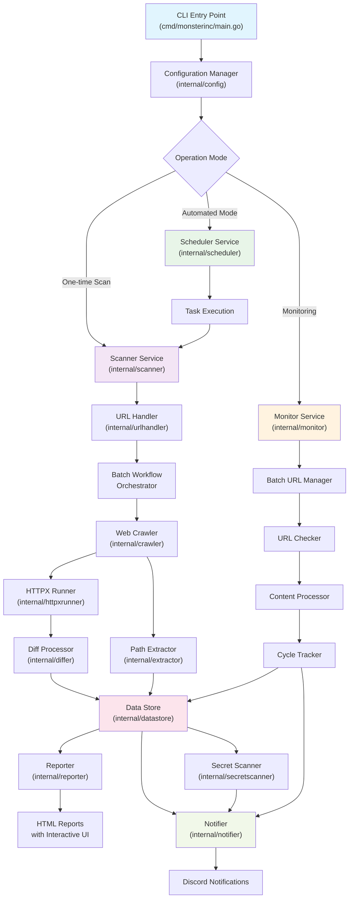

# MonsterInc

MonsterInc is a comprehensive security tool written in Go, specialized for URL collection from websites, HTTP/HTTPS probing, real-time content change monitoring, and detailed report generation. This tool is designed to support security professionals in web application reconnaissance and monitoring.

## Key Features

### 🕷️ URL Collection (Web Crawling)
- URL collection from websites with detailed scope configuration
- Headless browser support for dynamic content
- Scope control by hostname, subdomain, file extensions
- Resource extraction from HTML (images, scripts, stylesheets)
- **Responsive interrupt handling** - immediate stop upon receiving SIGINT/SIGTERM

### 🔍 HTTP/HTTPS Probing
- URL probing with integrated httpx engine
- Complete metadata extraction: headers, technologies, TLS information, ASN
- Smart retry and rate limiting support
- Automatic technology detection (tech detection)
- **Batch processing** - efficient processing for large datasets

### 📊 Real-time Change Monitoring
- Continuous website content monitoring with customizable intervals
- Change comparison using hash and diff algorithms
- **Batch URL processing** - efficient management of large URL sets
- Change history storage with Parquet format
- Visual HTML diff reports with change highlighting

### 🔒 Secret/API Keys Detection
- Scan and detect secrets, API keys, tokens in source code
- Optimized regex patterns for popular services
- Integration with crawling and monitoring workflows
- Detailed reports with context and location

### 📈 Reporting and Notifications
- Interactive HTML reports with DataTables
- Diff reports with syntax highlighting
- Automatic Discord notifications with file attachments
- Flexible template system for custom reports

## System Architecture



## Directory Structure

### Core Components

#### `cmd/monsterinc/`
- **`main.go`** - Main entry point with flag parsing and signal handling
- **`flags.go`** - Command-line flags and validation

#### `internal/scanner/`
- **Main orchestrator** for the entire scanning pipeline
- Manages workflow from crawling → probing → diffing → reporting
- Supports batch processing for large datasets
- Integration with all other components

#### `internal/monitor/`
- **Real-time monitoring service** for web content changes
- Batch URL management for efficient processing
- Change detection with content hashing
- Cycle tracking and progress management

#### `internal/crawler/`
- **Web crawling engine** based on Colly framework
- Asset extraction from HTML/CSS/JS
- Headless browser support for dynamic content
- Scope management and URL filtering

#### `internal/httpxrunner/`
- **HTTP probing wrapper** for httpx library
- Result mapping and error handling
- Technology detection and metadata extraction

#### `internal/datastore/`
- **Parquet-based storage layer** for high-performance persistence
- Streaming operations for memory efficiency
- File history tracking for monitoring
- Schema optimization for scan results

#### `internal/differ/`
- **Content comparison engine** with diff algorithms
- URL diffing for new/old/existing classification
- Content diffing with line-by-line analysis

#### `internal/reporter/`
- **HTML report generation** with interactive templates
- Asset embedding for standalone reports
- Multi-part reports for large datasets
- Custom CSS/JS injection

#### `internal/notifier/`
- **Discord notification system** with webhook integration
- File attachment handling with compression
- Message formatting with embed builders
- Error aggregation and batch notifications

### Supporting Components

#### `internal/config/`
- Centralized configuration management
- YAML/JSON parsing with validation
- Environment variable support
- Component-specific config builders

#### `internal/common/`
- Shared utilities and foundational components
- HTTP client with connection pooling
- File operations with context support
- Memory pools and resource limiting
- Progress tracking and display

#### `internal/models/`
- Data structures and interfaces
- Parquet schema definitions
- Notification payload builders

#### `internal/extractor/`
- Path extraction from JavaScript content
- URL validation and resolution
- Custom regex support

#### `internal/secretscanner/`
- Secret pattern detection
- Multiple rule sets for different services
- Context extraction for findings

#### `internal/urlhandler/`
- URL normalization and validation
- Target management from files/inputs

#### `internal/logger/`
- Structured logging with zerolog
- Multiple output formats (JSON, console)
- Log rotation and organization

#### `internal/scheduler/`
- Task scheduling with SQLite persistence
- Cron-like intervals with retry logic
- State management for automated scans

## Installation

### Prerequisites
- Go 1.21+
- Google Chrome (for headless browsing)

### Build from source

```bash
git clone https://github.com/your-org/monsterinc.git
cd monsterinc
go build -o bin/monsterinc cmd/monsterinc/main.go
```

### Configuration

Create `config.yaml` file:

```yaml
mode: "onetime"  # or "automated", "monitor"

crawler_config:
  max_depth: 3
  max_concurrent_requests: 20
  request_timeout_secs: 30
  seed_urls:
    - "https://example.com"
  
httpx_runner_config:
  threads: 50
  timeout_secs: 30
  tech_detect: true
  
monitor_config:
  enabled: true
  check_interval_seconds: 300
  max_concurrent_checks: 10
  
notification_config:
  scan_service_discord_webhook_url: "https://discord.com/api/webhooks/..."
  monitor_service_discord_webhook_url: "https://discord.com/api/webhooks/..."
  
storage_config:
  parquet_base_path: "./data"
  compression_codec: "zstd"
```

## Usage

### One-time Scan

```bash
./bin/monsterinc -config config.yaml -targets targets.txt
```

### Automated Scanning

```bash
./bin/monsterinc -config config.yaml -targets targets.txt -mode automated
```

### Monitoring Mode

```bash
./bin/monsterinc -config config.yaml -targets monitor-targets.txt -mode monitor
```

### Advanced Options

```bash
# Custom config location
./bin/monsterinc -config /path/to/config.yaml -targets targets.txt

# Override mode
./bin/monsterinc -config config.yaml -targets targets.txt -mode onetime

# Enable debug logging
./bin/monsterinc -config config.yaml -targets targets.txt -debug
```

## Detailed Key Features

### Batch Processing
- **Intelligent batching** for large URL sets (>500 URLs)
- Configurable batch sizes and concurrency
- Memory optimization with streaming operations
- Progress tracking across batches

### Interrupt Handling  
- **Graceful shutdown** with SIGINT/SIGTERM
- Context cancellation propagation
- Resource cleanup and state preservation
- Immediate response time (<2 seconds)

### Performance Optimization
- **Resource limiting** with memory/goroutine monitoring
- Connection pooling and HTTP/2 support
- Parquet format for fast I/O operations
- Memory pools for reduced GC pressure

### Security Focus
- **Secret detection** in source code
- Technology fingerprinting
- Change monitoring for security-critical files
- Comprehensive logging for audit trails

## Development

### Project Structure
```
monsterinc/
├── cmd/monsterinc/          # CLI entry point
├── internal/                # Private packages
│   ├── scanner/            # Main orchestration
│   ├── monitor/            # Real-time monitoring  
│   ├── crawler/            # Web crawling
│   ├── httpxrunner/        # HTTP probing
│   ├── datastore/          # Data persistence
│   ├── differ/             # Content comparison
│   ├── reporter/           # Report generation
│   ├── notifier/           # Notifications
│   └── common/             # Shared utilities
├── configs/                 # Sample configurations
└── tasks/                  # Task definitions
```

### Testing

```bash
# Run all tests
go test ./...

# Run tests with coverage
go test -cover ./...

# Run specific package tests
go test ./internal/scanner/
```

### Contributing

1. Fork repository
2. Create feature branch (`git checkout -b feature/amazing-feature`)
3. Commit changes (`git commit -am 'Add amazing feature'`)
4. Push branch (`git push origin feature/amazing-feature`)
5. Create Pull Request

## License

Distributed under the MIT License. See `LICENSE` for more information.

## Contact

- Project Repository: [https://github.com/your-org/monsterinc](https://github.com/your-org/monsterinc)
- Issues: [https://github.com/your-org/monsterinc/issues](https://github.com/your-org/monsterinc/issues)

